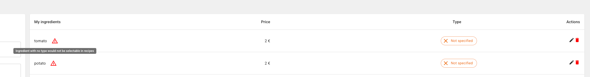

# Report

## <span style=" color: red ">Installation </span>

I had to modify the Makefile (line 9) to run docker compose with the new version of docker.

New syntax for docker compose is:
```bash
docker compose up
```

instead of:
```bash
docker-compose up
```


## <span style=" color: red ">Code Analysis / Remarks</span> 
Sometimes, I left commented code for reference.<br/>
I did not added more complexity regarding git structure with pull requests and branches, so I can code as fast as possible.<br/><br />

### General 

- Add eslint and prettier in both front-end and back-end. <br/><br />
- Simplify condition whenever it is possible (empty string or undefined are both falsy and can be replaced by !variable) ``` CreateIngredientForm``` line 19.<br/><br />


### API
- The application should be accessible via access tokens (JWT for instance).<br/><br />
- Some variables are unnecessary, like in ```IngredientService```. Could be replaced with a return.<br/><br /> 
- Naming is unclear at certain areas, like in ```IngredientController``` where ingredients are called recipes. <br/><br />
- Back-end might need more rules. For instance, we might want to avoid creating ingredients with the same name. <br/><br />
- Back-end should have at least unitary tests with a library like jest for function / methods with logic (if judged necessary). <br/><br />
- This is more subjective, but usually I store strings in lowercase in the database. I format them if needed on the front side. <br/><br />
- Controllers should have validators, either with the use of dedicated libraries (like express-validator) or with the use of custom middleware. <br/><br />
- In a real life scenario we might want to avoid fetching all the data at once for performance reasons. We could use pagination or infinite scroll for such cases. <br/><br />
- Back-end should sanitize inputs to avoid SQL injection attacks. Modern ORM do this by their own, but I would make the extra step of cleaning the strings just in case.<br/><br />
- This is more subjective, I would refactor the application using DDD principle (domain driven design). It would allow us to have all the rules in one layer avoiding having them in the controller or services. <br/><br />
- In the Back-end, we use static methods which prevent us from using attributes. Using class instaciations coupled with dependency injection would allow us using classes full potential, and avoid sketchy code like instantiating a variable in a static method that would be needed elsewhere in the class. <br/><br />
- Return proper status code depending on the failing case. Return a proper error message in case of error. Alternatively, if a request does happen properly and the created element is not
  used in the front-end, we should not return the created element. If the api is compromised, we want to give as little information as possible to the attacker, so he has a hard time understanding how the api works.<br/><br />

### Front-end
- Submit buttons should be disabled when the form is not valid. <br /><br />
- Maybe use more icon rather than plain text (more appealing). <br/><br />
- Set internationalization for the front-end. I would suggest using i18n library. <br /><br />
- Add filters in tables when needed. In our case, it might be interesting to filter ingredients by type. <br /><br />
- Never use alert in the front-end. It is prone to cross-site scripting (XSS) attacks. Use a notification system instead. <br /><br />
- Add a notification system that would inform whenever an action is successful or not (with clear messages in case of server errors). <br /><br />
- If possible, separate variable instantiation (I would place them at the beginning of the component function), from components methods.<br/><br />
- In a more complex project, using a store would be necessary to store data that are necessary in many pages (if it is not raw data from api) or to avoid props drilling. <br /><br />
- This is more subjective, but whenever it is possible I would regroup all api calls in the parent component (in our case ``` IngredientPage```...). This is better for readability and maintainability. <br /><br />


## <span style=" color: red ">Front-end bug</span>
Front end bug is resolved by:

1. Creating a new method within ```IngredientPage``` and pass it to the child component ```CreateIngredientForm``` in order to be used when a new ingredient is created. <br /><br />
2. Call refetch function provided by the hook useQuery in the method created in step 1.


## <span style=" color: red ">Tag handling</span>

- [X] Add a tag to the ingredient table
- [X] Modify Ingredient form
- [ ] Make Ingredient form editable
- [X] Make ingredients with no type unselectable in recipe page
- [X] Recipe creation / update are done with expected rules
- [ ] If an ingredient type is modified after a recipe creation, wich makes it invalid, a message should appear on the recipe page. <br />

When I added the type to the ingredient table, I thought about the easy way out of setting vegetable as a default value.<br/>
Only It would not have made sens for most ingredients.
In a real life (complex) scenario, we would need a script to update the database with the new column and set a default value for all ingredients.<br />
But because my case was simple, I decided to set the new column with an enum that can be equal to NULL
That case is then handled in the application.<br/><br />


<br/><br/><br/><br/>


